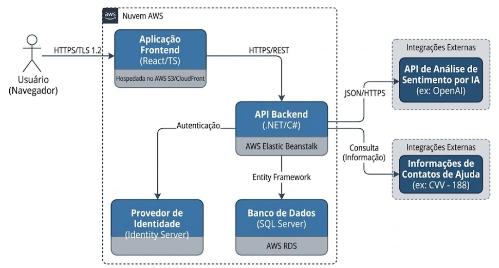
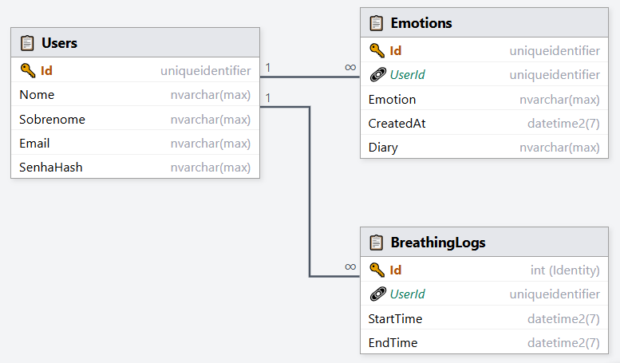
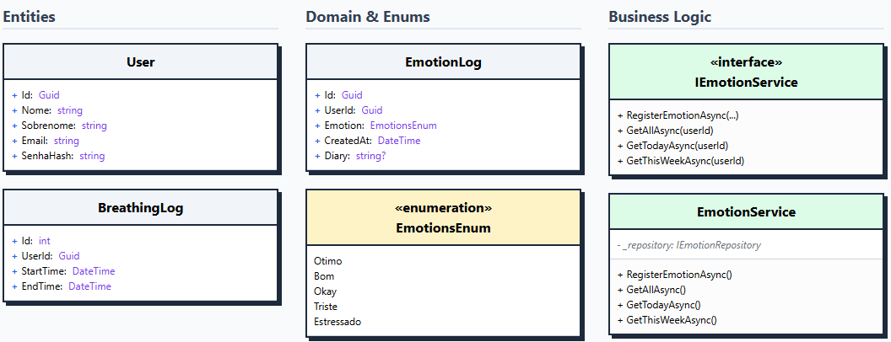

# 4. Projeto da Solução

## 4.1 Arquitetura da Solução (Sprint 1 e 2)

**Front-end → API (Back-end) → Banco de Dados**



---

## 4.2 Tecnologias Utilizadas (Sprint 1)

| Dimensão | Tecnologia Escolhida |
|----------|----------------------|
| Banco de Dados (SGBD) | SQL Server |
| Back-end (API) | C# (.NET Core) |
| Front-end / Mobile | React + TypeScript |
| Hospedagem / Deploy |  |
| Gestão e Versionamento | GitHub e GitHub Projects (Kanban) |

---

##  4.3 Wireframes ou Mockups (A partir da Sprint 2)

## 📌 Tela de Cadastro (RF-01)

**História associada:** Como usuário, quero me cadastrar na plataforma para que eu possa receber apoio emocional
**Descrição:** A interface contempla todos os campos exigidos pelo RF-01 e permite persistência no banco após validação no backend.

[Colocar wireframe aqui]

## 4.4 Modelagem de Dados (Sprint 2 e 3)

### 4.4.1 Script Físico (Entrega na Sprint 2 - MVP)

```sql
USE [EmotIA]

GO

SET ANSI_NULLS ON

GO

SET QUOTED_IDENTIFIER ON

GO

CREATE TABLE [dbo].[BreathingLogs](

[Id] [int] IDENTITY(1,1) NOT NULL,

[UserId] [uniqueidentifier] NOT NULL,

[StartTime] [datetime2](7) NOT NULL,

[EndTime] [datetime2](7) NOT NULL,

 CONSTRAINT [PK_BreathingLogs] PRIMARY KEY CLUSTERED 

(

[Id] ASC

)WITH (PAD_INDEX = OFF, STATISTICS_NORECOMPUTE = OFF, IGNORE_DUP_KEY = OFF, ALLOW_ROW_LOCKS = ON, ALLOW_PAGE_LOCKS = ON, OPTIMIZE_FOR_SEQUENTIAL_KEY = OFF) ON [PRIMARY]

) ON [PRIMARY]

GO

SET ANSI_NULLS ON

GO

SET QUOTED_IDENTIFIER ON

GO

CREATE TABLE [dbo].[Emotions](

[Id] [uniqueidentifier] NOT NULL,

[UserId] [uniqueidentifier] NOT NULL,

[Emotion] [nvarchar](max) NOT NULL,

[CreatedAt] [datetime2](7) NOT NULL,

[Diary] [nvarchar](max) NULL,

 CONSTRAINT [PK_Emotions] PRIMARY KEY CLUSTERED 

(

[Id] ASC

)WITH (PAD_INDEX = OFF, STATISTICS_NORECOMPUTE = OFF, IGNORE_DUP_KEY = OFF, ALLOW_ROW_LOCKS = ON, ALLOW_PAGE_LOCKS = ON, OPTIMIZE_FOR_SEQUENTIAL_KEY = OFF) ON [PRIMARY]

) ON [PRIMARY] TEXTIMAGE_ON [PRIMARY]

GO

SET ANSI_NULLS ON

GO

SET QUOTED_IDENTIFIER ON

GO

CREATE TABLE [dbo].[Users](

[Id] [uniqueidentifier] NOT NULL,

[Nome] [nvarchar](max) NOT NULL,

[Email] [nvarchar](max) NOT NULL,

[SenhaHash] [nvarchar](max) NOT NULL,

[Sobrenome] [nvarchar](max) NOT NULL,

 CONSTRAINT [PK_Users] PRIMARY KEY CLUSTERED 

(

[Id] ASC

)WITH (PAD_INDEX = OFF, STATISTICS_NORECOMPUTE = OFF, IGNORE_DUP_KEY = OFF, ALLOW_ROW_LOCKS = ON, ALLOW_PAGE_LOCKS = ON, OPTIMIZE_FOR_SEQUENTIAL_KEY = OFF) ON [PRIMARY]

) ON [PRIMARY] TEXTIMAGE_ON [PRIMARY]

GO

ALTER TABLE [dbo].[Users] ADD  DEFAULT (N'') FOR [Sobrenome]

GO
```

### 📁 Arquivo .sql

O arquivo .sql ou .js está salvo na pasta: src/bd

### 4.4.2 Representação do Modelo Físico de Dados (Entrega na Sprint 3 - Core)



---

### Classes UML


