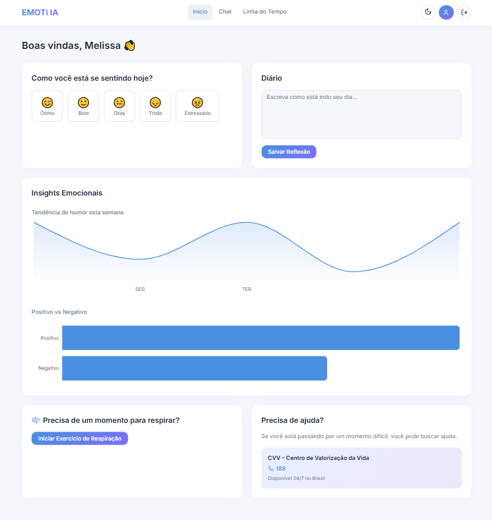
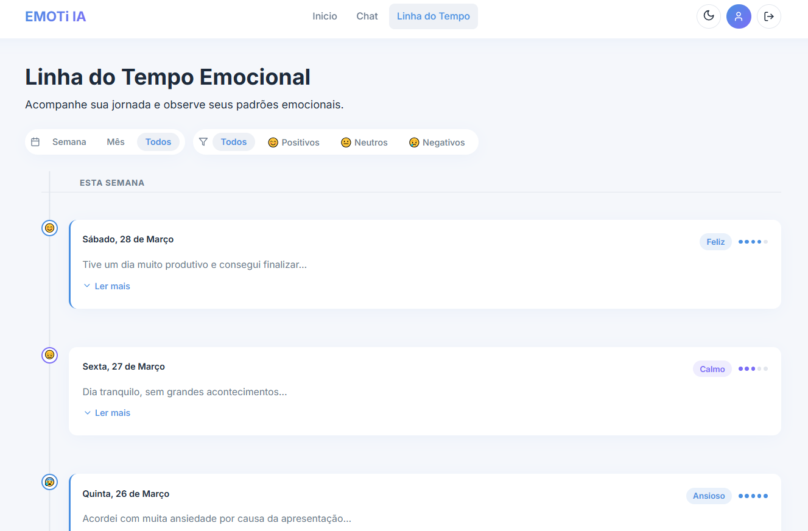
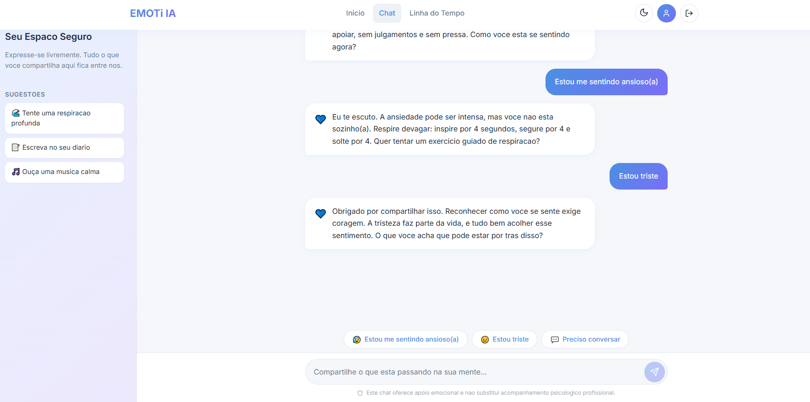

# 4. Projeto da Solução

## 4.1 Arquitetura da Solução (Sprint 1 e 2)

**Front-end → API (Back-end) → Banco de Dados**


---

## 4.2 Tecnologias Utilizadas (Sprint 1)

| Dimensão | Tecnologia Escolhida |
|----------|----------------------|
| Banco de Dados (SGBD) | SQL Server |
| Back-end (API) | C# (.NET Core) |
| Front-end / Mobile | React + TypeScript |
| Hospedagem / Deploy |  |
| Gestão e Versionamento | GitHub e GitHub Projects (Kanban) |

---

##  4.3 Wireframes ou Mockups (A partir da Sprint 2)

## 📌 Tela de Cadastro (RF-01)

**História associada:** Como usuário, quero me cadastrar na plataforma informando meus dados e rotina, para que eu possa receber um apoio personalizado de acordo com o meu perfil.

**Descrição:** Interface para coleta de dados iniciais, preferências e hábitos do usuário. Os dados são validados no backend para garantir a integridade da personalização do suporte emocional.


## 📌 Página Inicial

### Diário de Sentimentos (RF-02)

**História associada:** Como usuário, quero registrar como me sinto e escrever sobre o meu dia, para que eu possa manter um histórico das minhas reflexões e sentimentos.

**Descrição:** Espaço para entrada de texto e seleção de emojis representativos de humor. Permite a persistência de registros diários vinculados ao perfil do usuário.

### Dashboard de Emoções (RF-03)

**História associada:** Como usuário, quero visualizar gráficos com a minha tendência de humor, para que eu consiga identificar padrões emocionais ao longo da minha semana.

**Descrição:** Painel visual que consome os dados do diário para gerar gráficos de linha ou barras, facilitando a visualização da oscilação emocional em períodos de 7 dias.

### Exercícios de Respiração (RF-07) e Central de Ajuda e Crise (RF-08)

História associada: Como usuário, quero realizar sessões guiadas de respiração, para que eu consiga reduzir o estresse e a ansiedade de forma prática dentro da plataforma; quero encontrar contatos de órgãos competentes de saúde mental, para que eu saiba onde buscar ajuda profissional externa de forma rápida e segura.

Descrição: Tela interativa com guia visual que orienta o usuário em técnicas de respiração + seção de acesso rápido contendo números de emergência (como o CVV)



## 📌 Linha do Tempo (RF-04 e RF-05)

**História associada:** Como usuário, quero ver meus registros antigos em uma linha do tempo e filtrá-los, para que eu possa reler momentos específicos e entender minha evolução emocional.

**Descrição:** Lista cronológica de registros anteriores com suporte a filtros por data ou tipo de sentimento, permitindo o resgate rápido de memórias e reflexões.



## 📌 Chat de Apoio (RF-06)

**História associada:** Como usuário, quero interagir com um chat de apoio, para que eu tenha um espaço imediato para conversar e desabafar em momentos de necessidade.

**Descrição:** Interface de chat em tempo real projetada para oferecer escuta ativa e suporte imediato através de processamento de linguagem natural.



---

## 4.4 Modelagem de Dados (Sprint 2 e 3)

### 4.4.1 Script Físico (Entrega na Sprint 2 - MVP)

```sql
USE [EmotIA]

GO

SET ANSI_NULLS ON

GO

SET QUOTED_IDENTIFIER ON

GO

CREATE TABLE [dbo].[BreathingLogs](

[Id] [int] IDENTITY(1,1) NOT NULL,

[UserId] [uniqueidentifier] NOT NULL,

[StartTime] [datetime2](7) NOT NULL,

[EndTime] [datetime2](7) NOT NULL,

 CONSTRAINT [PK_BreathingLogs] PRIMARY KEY CLUSTERED 

(

[Id] ASC

)WITH (PAD_INDEX = OFF, STATISTICS_NORECOMPUTE = OFF, IGNORE_DUP_KEY = OFF, ALLOW_ROW_LOCKS = ON, ALLOW_PAGE_LOCKS = ON, OPTIMIZE_FOR_SEQUENTIAL_KEY = OFF) ON [PRIMARY]

) ON [PRIMARY]

GO

SET ANSI_NULLS ON

GO

SET QUOTED_IDENTIFIER ON

GO

CREATE TABLE [dbo].[Emotions](

[Id] [uniqueidentifier] NOT NULL,

[UserId] [uniqueidentifier] NOT NULL,

[Emotion] [nvarchar](max) NOT NULL,

[CreatedAt] [datetime2](7) NOT NULL,

[Diary] [nvarchar](max) NULL,

 CONSTRAINT [PK_Emotions] PRIMARY KEY CLUSTERED 

(

[Id] ASC

)WITH (PAD_INDEX = OFF, STATISTICS_NORECOMPUTE = OFF, IGNORE_DUP_KEY = OFF, ALLOW_ROW_LOCKS = ON, ALLOW_PAGE_LOCKS = ON, OPTIMIZE_FOR_SEQUENTIAL_KEY = OFF) ON [PRIMARY]

) ON [PRIMARY] TEXTIMAGE_ON [PRIMARY]

GO

SET ANSI_NULLS ON

GO

SET QUOTED_IDENTIFIER ON

GO

CREATE TABLE [dbo].[Users](

[Id] [uniqueidentifier] NOT NULL,

[Nome] [nvarchar](max) NOT NULL,

[Email] [nvarchar](max) NOT NULL,

[SenhaHash] [nvarchar](max) NOT NULL,

[Sobrenome] [nvarchar](max) NOT NULL,

 CONSTRAINT [PK_Users] PRIMARY KEY CLUSTERED 

(

[Id] ASC

)WITH (PAD_INDEX = OFF, STATISTICS_NORECOMPUTE = OFF, IGNORE_DUP_KEY = OFF, ALLOW_ROW_LOCKS = ON, ALLOW_PAGE_LOCKS = ON, OPTIMIZE_FOR_SEQUENTIAL_KEY = OFF) ON [PRIMARY]

) ON [PRIMARY] TEXTIMAGE_ON [PRIMARY]

GO

ALTER TABLE [dbo].[Users] ADD  DEFAULT (N'') FOR [Sobrenome]

GO
```

### 📁 Arquivo .sql

O arquivo .sql ou .js está salvo na pasta: src/bd

### 4.4.2 Representação do Modelo Físico de Dados (Entrega na Sprint 3 - Core)


---

### Classes UML


